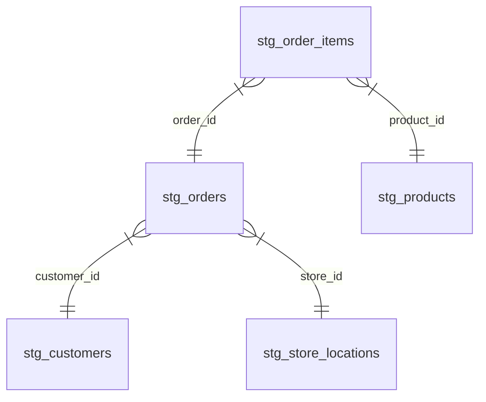

# Week 1: Sources, Models, and Seeds

 Welcome to Week 1 of the DataOps & dbt Mentorship Program! In this week, we'll cover the fundamental building blocks of a dbt project.

---

## 🍴 Step 1: Fork & Clone
Before starting the setup, ensure you have your own copy of the repository:
1. **Fork** this repository to your own GitHub account.
2. **Clone** your fork to your local machine:
   ```bash
   git clone https://github.com/YOUR_USERNAME/dataops-labs.git
   cd dataops-labs
   cd dbt_learning
   ```

---

## 🚀 Step 2: Environment Setup (Python Virtual Environment)

Before we start, let's set up a Python virtual environment and install dbt locally. This allows you to run dbt commands directly from your machine instead of using Docker (though Docker is available for the database and Airflow).

**1. Create a virtual environment:**
```bash
python -m venv venv
```

**2. Activate the virtual environment:**
*   **Windows (Command Prompt):** `venv\Scripts\activate.bat`
*   **Windows (PowerShell):** `.\venv\Scripts\Activate.ps1`
*   **Mac/Linux:** `source venv/bin/activate`

**3. Install dbt for PostgreSQL:**
```bash
pip install dbt-postgres==1.9.*
```

**4. Verify the installation:**
```bash
dbt --version
```

---

## 🗄️ Database Credentials

We are using a local PostgreSQL database running in a Docker container. You will need these details to configure your `profiles.yml` file so dbt can connect to the database.

*   **Host:** `localhost`
*   **Port:** `5432`
*   **Database:** `ecommerce`
*   **User:** `dataops`
*   **Password:** `dataops_pass_2024`
*   **Default Schema:** `DEV` (or the schema you want your models to build into)

*(Note: To start the database, ensure you run `docker compose up -d postgres` from the project root).*

---

## 🧊 Data Modeling 101: Facts & Dimensions

As you move from the **STAGE** layer (cleansing) to the **DEV** layer (business logic), you will start building a **Star Schema**. 

*   **Dimension Tables (The "What"):** These contain descriptive data about entities (Customers, Products, Stores).
*   **Fact Tables (The "When/How much"):** These contain transactional data or events (Orders, Items Sold).

### Visualizing the Relationships
Here is how your staged models work together to create the Fact and Dimension tables:



---


## 📖 Lesson Overview

This week, we focus on getting data into our data warehouse and cleaning it up using dbt.

*   **Sources:** How to tell dbt where to find the raw data already loaded into our database.
*   **The Two Layers:** We will write `STAGE` models to clean the raw data (fixing names and formats). Then, we will write `DEV` models to do the math (like calculating total orders). Remember: **DEV models never touch raw data — they only reference STAGE.**
*   **Seeds:** How to take a simple CSV file (like a list of store locations) and upload it directly into PostgreSQL so we can join it with our data.

---

## 📝 Assignment Tasks

Your goal this week is to load raw data using seeds, define them as sources, and build the starting foundation of our staging and dev layers. 

### Task 1.1 — Load All Seeds (15 pts)
Run `dbt seed` to load all 5 CSV files (`raw_customers.csv`, `raw_products.csv`, etc.) into the database.
**Deliverable:** Screenshot of `dbt seed` output showing all 5 seeds loaded successfully.

### Task 1.2 — Define Sources (15 pts)
Create `models/stage/sources.yml` that declares all 5 raw tables as dbt sources so dbt can manage them.
**Deliverable:** The `sources.yml` file.

### Task 1.3 — Build STAGE Models (40 pts)
Create one staging model per seed table in `models/stage/`. You will do basic cleaning like trimming text, standardizing cases, and casting data types.

**💡 Pro-Tip: Example Staging Model**
Here is how `stg_orders.sql` might look. Notice how we use `source()` to pull from our seeds, and `coalesce()` to handle null values:

```sql
with source as (
    select * from {{ source('RAW', 'raw_orders') }}
),

cleaned as (
    select
        order_id::integer                               as order_id,
        trim(customer_id)::text                         as customer_id,
        order_date::date                                as order_date,
        lower(trim(status))::text                       as order_status,
        coalesce(shipping_fee, 0)::numeric(12,2)        as shipping_fee
    from source
)

select * from cleaned
```

**Deliverable:** All 5 SQL files under `models/stage/`.

*   `stg_customers.sql` (Trim names, lowercase email, cast `signup_date` to date)
*   `stg_products.sql` (Trim `product_name`, cast prices to `numeric(12,2)`, cast `is_active` to boolean)
*   `stg_orders.sql` (Lowercase + trim `status`, cast `order_date` to date, default `shipping_fee` nulls to 0)
*   `stg_order_items.sql` (Cast qty to integer, prices to `numeric(12,2)`, default `discount_pct` to 0)
*   `stg_store_locations.sql` (Trim all text, cast `opened_date` to date)

### Task 1.4 — Build DEV Fact Model (20 pts)
Create `models/dev/fct_order_details.sql` that joins staged orders, order items, products, and customers.

**💡 Logic Hints:**
*   **The Grain**: This table should have one row per item in an order. Use `stg_order_items` as your base table.
*   **Net Amount**: `quantity * unit_price * (1 - discount_pct / 100.0)`
*   **Total Amount**: `net_amount` + `shipping_fee` (from `stg_orders`)

**Deliverable:** The `fct_order_details.sql` file producing one row per order line with calculated gross/net/total amounts.

### Task 1.5 — Build DEV Dimension Model (10 pts)
Create `models/dev/dim_customers.sql` — a customer dimension aggregating the total number of orders and the total amount spent per customer.

**💡 Logic Hints:**
*   **Aggregation**: You will need to join `stg_customers` with your new `fct_order_details` model.
*   **Grouping**: Every descriptive column must be included in the `GROUP BY` clause.
*   **Metrics**: Calculate `count(order_id)` for `total_orders` and `sum(total_amount)` for `total_spent`.

**Deliverable:** The `dim_customers.sql` file.

Good luck!
