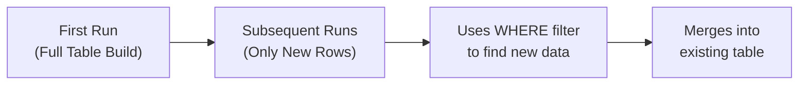

# Week 2: Materializations

Welcome to Week 2 of the DataOps & dbt Mentorship Program! This week, we'll learn how dbt stores your models in the database and how to make your pipeline efficient.

---

## ✅ Prerequisites

Before starting Week 2, make sure you have completed **all of Week 1**:

- [ ] All 5 seeds loaded (`dbt seed`)
- [ ] `sources.yml` defined
- [ ] All 5 staging models in `models/stage/`
- [ ] `fct_order_details.sql` in `models/dev/`
- [ ] `dim_customers.sql` in `models/dev/`

> **If your Week 1 models are not working yet, fix them first.** Week 2 builds directly on top of them.

---

## 📖 Lesson Overview

### What is a Materialization?

A **materialization** tells dbt _how_ to store the result of a model in the database. Think of it like choosing between saving a Word document (a **table** — stored on disk) or bookmarking a Google search (a **view** — runs the query every time).

dbt supports these materializations:

| Type          | What it does                                   | When to use                                   |
| ------------- | ---------------------------------------------- | --------------------------------------------- |
| `view`        | Creates a SQL view (query runs every time)     | Lightweight transformations, staging models   |
| `table`       | Creates a physical table (data stored on disk) | Final models, dashboards, heavy aggregations  |
| `incremental` | Appends/updates only new or changed rows       | Large fact tables that grow over time         |
| `ephemeral`   | Not saved — inlined as a CTE                   | Helper logic you don't need to query directly |

### The Two-Layer Strategy

```
STAGE layer → materialized as VIEWS (cheap, always up-to-date)
DEV layer   → materialized as TABLES (fast for dashboards)
```

### What is an Incremental Model?

Imagine you have 10 million orders. Every day, 1,000 new orders arrive. Without incremental:

- dbt drops the entire table and rebuilds all 10 million rows — **every single time**.

With incremental:

- On the **first run**, dbt builds the full table (like a normal table).
- On **every run after that**, dbt only processes the **new rows** (the 1,000 new orders).



### What is a Snapshot?

A **snapshot** captures how data looks _right now_ and preserves old versions when data changes. This is called tracking **Slowly Changing Dimensions (SCD Type 2)**.

Example: If a product's price changes from $29.99 to $39.99, a snapshot keeps _both_ records:

| product_id | list_price | dbt_valid_from | dbt_valid_to |
| ---------- | ---------- | -------------- | ------------ |
| P-001      | 29.99      | 2024-01-01     | 2024-06-15   |
| P-001      | 39.99      | 2024-06-15     | _null_       |

The row with `dbt_valid_to = null` is the **current** version.

---

## 📝 Assignment Tasks

### Task 2.1 — Materialization Comparison (15 pts)

Create a file called `docs/materializations.md` that answers these three questions **in your own words**:

1. **What is the difference between a `table` and a `view` in PostgreSQL?**
   - How is data stored differently?
   - What happens when you query each one?

2. **When would you use a `view` in the STAGE layer vs a `table` in the DEV layer?**
   - Think about: how often does data change? who queries it? how heavy is the query?

3. **What problem does `incremental` materialization solve?**
   - Give a real-world example (use our order data as context)

**Deliverable:** `docs/materializations.md` with at least 200 words total.

| Criteria                                          | Points |
| ------------------------------------------------- | ------ |
| Correct explanation of table vs view              | 5      |
| Valid reasoning for layer-materialization pairing | 5      |
| Incremental use case explained with example       | 5      |

---

### Task 2.2 — Incremental Fact Model (40 pts)

Convert your `fct_order_details.sql` model to use **incremental materialization**.

**What you need to do:**

1. Add the `config()` block at the top of your model
2. Add the `` filter
3. Use a 3-day look-back window

**💡 Code Hints:**

The `config()` block should look like this:

```sql
{{
    config(
        materialized='incremental',
        unique_key='order_item_id'
    )
}}
```

The `is_incremental()` block goes inside your query — it adds a WHERE clause that only runs on subsequent (non-first) runs:

```sql

    where order_date > (select max(order_date) from {{ this }}) - interval '3 days'

```

> **Key concept:** `{{ this }}` refers to the _existing_ version of the table in the database. On the first run, the table doesn't exist yet, so `is_incremental()` returns `false` and dbt builds the full table.

**Testing your work:**

```bash
# First run — builds the full table (like a normal table)
dbt run --select fct_order_details --full-refresh --profiles-dir .

# Second run — should only process recent rows
dbt run --select fct_order_details --profiles-dir .
```

**Deliverable:** Updated `fct_order_details.sql` with incremental config.

| Criteria                                                               | Points |
| ---------------------------------------------------------------------- | ------ |
| Correct `config()` block with `materialized='incremental'`             | 5      |
| `unique_key` is set to `order_item_id`                                 | 5      |
| `` block filters on `order_date`              | 10     |
| Look-back window uses `current_date - interval '3 days'` or equivalent | 5      |
| Full refresh (`dbt run --full-refresh`) succeeds                       | 5      |
| Regular incremental run succeeds                                       | 5      |
| Student can explain what happens on first run vs subsequent runs       | 5      |

---

### Task 2.3 — Snapshot: Product Price Changes (30 pts)

Create a snapshot file at `snapshots/snap_products.sql` that tracks changes to product pricing.

**What you need to do:**

1. Create a `` block
2. Configure it to watch specific columns for changes
3. Point it at the raw products table

**💡 Code Hints:**

A snapshot file has this general structure:

```sql


{{
    config(
        target_schema='RAW',
        unique_key='???',          -- the primary key of the source table
        strategy='check',          -- detect changes by comparing column values
        check_cols=['???', '???']  -- which columns to watch for changes
    )
}}

select * from {{ source('RAW', '???') }}


```

**Your task:** Fill in the `???` placeholders. You need to:

- Set `unique_key` to the product's primary key column
- Set `check_cols` to track changes in `list_price` and `is_active`
- Select from the correct raw source table

**Testing your work:**

```bash
# Run the snapshot for the first time
dbt snapshot --profiles-dir .
```

**Deliverable:** A working `snapshots/snap_products.sql` file.

| Criteria                                                              | Points |
| --------------------------------------------------------------------- | ------ |
| Correct `` block syntax                                 | 5      |
| Uses `strategy='check'` with `check_cols=['list_price', 'is_active']` | 10     |
| `unique_key` set to `product_id`                                      | 5      |
| Snapshot runs (`dbt snapshot`) without errors                         | 5      |
| Student can explain `dbt_valid_from` and `dbt_valid_to` columns       | 5      |

---

### Task 2.4 — Simulation Exercise (15 pts)

This is a hands-on exercise to prove your snapshot is working. You will **change some data** and watch the snapshot capture the history.

**Step-by-step:**

1. **Run the snapshot once** (baseline):

   ```bash
   dbt snapshot --profiles-dir .
   ```

2. **Modify `seeds/raw_products.csv`** — change the `list_price` for these **2 products**:
   - Change `P-005` (Wireless Mouse MX) price from `59.99` to `69.99`
   - Change `P-013` (Noise-Cancel Headphones) price from `199.99` to `179.99`

3. **Reload the seed data and re-snapshot:**

   ```bash
   dbt seed --profiles-dir .
   dbt snapshot --profiles-dir .
   ```

4. **Query the snapshot table** to see both old and new records:

   ```sql
   SELECT product_id, product_name, list_price,
          dbt_valid_from, dbt_valid_to
   FROM "RAW"."snap_products"
   WHERE product_id IN ('P-005', 'P-013')
   ORDER BY product_id, dbt_valid_from;
   ```

**Deliverable:** Screenshot or SQL output showing the version history (old price with `dbt_valid_to` filled in, new price with `dbt_valid_to = null`).

| Criteria                                                     | Points |
| ------------------------------------------------------------ | ------ |
| Successfully modified seed data                              | 3      |
| Snapshot captured both old and new versions                  | 7      |
| Query correctly filters to show history for changed products | 5      |

---

### Week 2 Total: **100 points**

---

## 🔧 dbt Commands Reference

```bash
# Run all models
dbt run --profiles-dir .

# Run a specific model
dbt run --select fct_order_details --profiles-dir .

# Full refresh (rebuilds incremental from scratch)
dbt run --full-refresh --profiles-dir .

# Run snapshot
dbt snapshot --profiles-dir .

# Reload seed data
dbt seed --profiles-dir .

# Check your project compiles
dbt compile --profiles-dir .
```

---

## 📂 Expected File Structure After Week 2

```
dbt_learning/
├── models/
│   ├── stage/
│   │   ├── sources.yml
│   │   ├── stg_customers.sql
│   │   ├── stg_products.sql
│   │   ├── stg_orders.sql
│   │   ├── stg_order_items.sql
│   │   └── stg_store_locations.sql
│   └── dev/
│       ├── fct_order_details.sql  ← NOW INCREMENTAL
│       └── dim_customers.sql
├── snapshots/
│   └── snap_products.sql          ← NEW
└── docs/
    └── materializations.md        ← NEW
```

Good luck! 🚀
