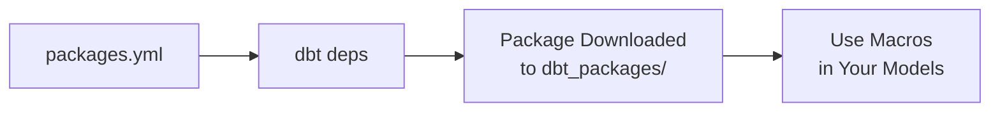

# Week 4: Macros and Packages

Welcome to Week 4 of the DataOps & dbt Mentorship Program! This week, we'll learn how to **write reusable code** using Jinja macros and leverage the power of **community packages** to supercharge your dbt project.

---

## ✅ Prerequisites

Before starting Week 4, make sure you have completed **all of Week 3**:

- [ ] `models/stage/schema.yml` with generic tests
- [ ] All 5 custom singular tests in `tests/`
- [ ] `models/dev/quarantine_orders.sql` working
- [ ] `docs/data_quality_report.md` written

> **If your Week 3 models are not working yet, fix them first.** Week 4 builds directly on top of them.

---

## 📖 Lesson Overview

### What is Jinja?

Jinja is a **templating language** that dbt uses to make SQL dynamic. You've already been using it — `{{ ref() }}`, `{{ source() }}`, and `` are all Jinja. This week, we go deeper.

Think of Jinja like a code generator. Before dbt sends your SQL to PostgreSQL, it first **renders** the Jinja into plain SQL. This means you can use variables, loops, and conditionals to generate SQL dynamically.

### Jinja Syntax Quick Reference

| Syntax | Purpose | Example |
| --- | --- | --- |
| `{{ ... }}` | Output an expression | `{{ ref('stg_orders') }}` |
| `` | Execute a statement | `` |
| `{# ... #}` | Comment (not rendered) | `{# This is a comment #}` |

### What is a Macro?

A **macro** is a reusable Jinja function. Instead of copying and pasting the same SQL formula across multiple models, you write it once as a macro and call it everywhere.


**Example:**

```sql
-- macros/cents_to_dollars.sql

    ({{ column_name }} / 100.0)::numeric(12,2)

```

```sql
-- Usage in a model:
select
    order_id,
    {{ cents_to_dollars('amount_cents') }} as amount_dollars
from {{ ref('stg_payments') }}
```

### What are dbt Packages?

dbt packages are **pre-built collections of macros, tests, and models** shared by the community. Instead of writing everything from scratch, you can install a package and use it immediately.

The most popular package is **dbt-utils**, which includes dozens of useful macros like:

- `generate_surrogate_key()` — creates a unique hash key from multiple columns
- `date_spine()` — generates a continuous range of dates
- `pivot()` — pivots rows into columns
- `star()` — selects all columns from a relation



---

## 📝 Assignment Tasks

### Task 4.1 — Jinja Basics: Monthly Revenue Pivot (15 pts)

Create `models/dev/fct_monthly_revenue.sql` that uses Jinja to dynamically generate a **pivot table** of monthly revenue by store.

**What you need to do:**

1. Use `` to define the target year
2. Use `` to loop through months and generate 12 revenue columns
3. Produce a table with one row per store and columns: `store_id`, `jan_revenue`, `feb_revenue`, ..., `dec_revenue`

**💡 Code Hints:**

Here's the general structure:

```sql




with order_data as (

    select
        o.store_id,
        o.order_date,
        oi.quantity * oi.unit_price * (1 - oi.discount_pct / 100.0) as net_amount
    from {{ ref('stg_orders') }} o
    inner join {{ ref('stg_order_items') }} oi
        on o.order_id = oi.order_id

)

select
    store_id,

    
    sum(
        case
            when extract(year from order_date) = {{ target_year }}
             and extract(month from order_date) = {{ month_num }}
            then net_amount
            else 0
        end
    ) as {{ month_name }}_revenue{{ "," if not loop.last }}
    

from order_data
group by store_id
order by store_id
```

> **Key concept:** The `` loop generates 12 `CASE WHEN` statements — one for each month. The `loop.last` variable prevents a trailing comma after the last column.

**Testing your work:**

```bash
# Check the generated SQL (look at the compiled output)
dbt compile --select fct_monthly_revenue --profiles-dir .

# Run the model
dbt run --select fct_monthly_revenue --profiles-dir .
```

> **Pro tip:** Run `dbt compile` first and inspect `target/compiled/.../fct_monthly_revenue.sql` to see the raw SQL that Jinja produces. This is very helpful for debugging!

**Deliverable:** `models/dev/fct_monthly_revenue.sql`

| Criteria | Points |
| --- | --- |
| Correct use of `` variable | 3 |
| `` loop generates 12 month columns | 7 |
| Model compiles and produces correct pivot | 5 |

---

### Task 4.2 — Currency Converter Macro (30 pts)

Create `macros/convert_currency.sql` — a reusable macro that converts monetary amounts between currencies using fixed exchange rates.

**What you need to do:**

1. Create the macro file with 3 parameters: `amount_column`, `currency_column`, and `target_currency`
2. Handle conversions between USD, OMR, and EUR
3. Use the macro in `fct_order_details` to add a `total_amount_usd` column

**Exchange Rates:**

| From | To USD |
| --- | --- |
| USD | 1.00 (no conversion) |
| OMR | 2.60 |
| EUR | 1.08 |

**💡 Code Hints:**

The macro file should look like this:

```sql
-- macros/convert_currency.sql



    case
        when upper({{ currency_column }}) = '{{ target_currency }}'
            then {{ amount_column }}

        
        when upper({{ currency_column }}) = 'OMR'
            then {{ amount_column }} * 2.60
        when upper({{ currency_column }}) = 'EUR'
            then {{ amount_column }} * 1.08
        

        else {{ amount_column }}  -- default: no conversion
    end


```

**Using the macro in `fct_order_details`:**

You'll need to join `stg_products` to get the `currency` column, then call:

```sql
{{ convert_currency('net_amount', 'p.currency', 'USD') }} as total_amount_usd
```

**Testing your work:**

```bash
# Run the model
dbt run --select fct_order_details --full-refresh --profiles-dir .
```

Then verify in your SQL client:

```sql
-- Check that OMR products are converted correctly
-- P-033 (Arabic Keyboard Cover) costs 4.90 OMR = 12.74 USD
-- P-034 (Oman Flag Mouse Pad) costs 2.50 OMR = 6.50 USD
SELECT order_item_id, product_name, currency, net_amount, total_amount_usd
FROM "DEV"."fct_order_details"
WHERE currency = 'OMR'
LIMIT 5;
```

**Deliverable:** `macros/convert_currency.sql` + updated `fct_order_details.sql`

| Criteria | Points |
| --- | --- |
| Macro accepts column name, source currency, and target currency | 5 |
| Handles at least 3 currencies (USD, OMR, EUR) | 5 |
| Uses `` / `` or CASE WHEN | 5 |
| Macro is applied in at least one model | 5 |
| Correct USD conversion results (manually verified for 3 rows) | 10 |

---

### Task 4.3 — Reusable Revenue Macro (20 pts)

Create `macros/calculate_revenue.sql` — a macro that standardizes the revenue calculation formula used across your models.

**What you need to do:**

1. Create the macro with 3 parameters: `quantity`, `unit_price`, `discount_pct`
2. Replace the hardcoded formula in `fct_order_details` with the macro call

**💡 Code Hints:**

```sql
-- macros/calculate_revenue.sql



    ({{ quantity }} * {{ unit_price }} * (1 - {{ discount_pct }} / 100.0))::numeric(12,2)


```

**Before (hardcoded):**

```sql
quantity * unit_price * (1 - discount_pct / 100.0) as net_amount
```

**After (using macro):**

```sql
{{ calculate_revenue('oi.quantity', 'oi.unit_price', 'oi.discount_pct') }} as net_amount
```

**Testing your work:**

```bash
# Compile to inspect the generated SQL
dbt compile --select fct_order_details --profiles-dir .

# Run to verify results match
dbt run --select fct_order_details --full-refresh --profiles-dir .
```

> **Key concept:** The results should be **identical** to the previous hardcoded version. The benefit is maintainability — if the formula changes (e.g., adding tax), you update it in one place.

**Deliverable:** `macros/calculate_revenue.sql` + updated `fct_order_details.sql`

| Criteria | Points |
| --- | --- |
| Macro is parameterized and reusable | 5 |
| Applied in `fct_order_details` replacing hardcoded math | 10 |
| Results match the original hardcoded version | 5 |

---

### Task 4.4 — Install and Use dbt-utils Package (20 pts)

Install the **dbt-utils** community package and use its macros in your project.

**What you need to do:**

1. Create `packages.yml` in the project root
2. Run `dbt deps` to install the package
3. Use `generate_surrogate_key` in `fct_order_details`
4. Use one more dbt-utils macro in any model

**Step 1: Create `packages.yml`**

Create this file in the `dbt_learning/` directory (same level as `dbt_project.yml`):

```yaml
packages:
  - package: dbt-labs/dbt_utils
    version: [">=1.0.0", "<2.0.0"]
```

**Step 2: Install the package**

```bash
dbt deps --profiles-dir .
```

**Step 3: Use `generate_surrogate_key` in `fct_order_details`**

Add a surrogate key column that combines `order_id` and `order_item_id`:

```sql
{{ dbt_utils.generate_surrogate_key(['oi.order_id', 'oi.order_item_id']) }} as order_detail_sk,
```

> **What is a surrogate key?** It's a hashed unique identifier created from multiple columns. Instead of relying on natural keys (which can change), a surrogate key gives you a stable, unique row identifier.

**Step 4: Use another dbt-utils macro**

Choose one of these options:

**Option A** — Use `star()` to select all columns from a relation:

```sql
-- In any staging model:
select {{ dbt_utils.star(from=ref('stg_customers'), except=["phone"]) }}
from {{ ref('stg_customers') }}
```

**Option B** — Use `date_spine()` to create a date dimension:

```sql
-- models/dev/dim_dates.sql
{{
    config(materialized='table')
}}

{{ dbt_utils.date_spine(
    datepart="day",
    start_date="cast('2023-01-01' as date)",
    end_date="cast('2025-12-31' as date)"
) }}
```

**Option C** — Use `get_column_values()` to dynamically get distinct values:

```sql
-- Get all distinct product categories

```

**Testing your work:**

```bash
# Install packages
dbt deps --profiles-dir .

# Run models
dbt run --profiles-dir .
```

**Deliverable:** `packages.yml` + updated models using dbt-utils macros.

| Criteria | Points |
| --- | --- |
| `packages.yml` is correct and `dbt deps` succeeds | 5 |
| `generate_surrogate_key` used correctly | 5 |
| Second dbt-utils macro used in a meaningful way | 5 |
| Models compile and run | 5 |

---

### Task 4.5 — Macro Documentation (15 pts)

Create `macros/macros.yml` that documents your two custom macros with descriptions, arguments, and usage examples.

**💡 Code Hints:**

```yaml
version: 2

macros:
  - name: convert_currency
    description: >
      Converts a monetary amount from one currency to USD (or another target)
      using fixed exchange rates. Supports USD, OMR, and EUR.
    arguments:
      - name: amount_column
        type: string
        description: "The column name containing the monetary value to convert"
      - name: currency_column
        type: string
        description: "The column name containing the ISO currency code (e.g., 'USD', 'OMR', 'EUR')"
      - name: target_currency
        type: string
        description: "The target currency code to convert to (default: 'USD')"

  - name: calculate_revenue
    description: >
      Calculates net revenue using the standard formula:
      quantity × unit_price × (1 − discount_pct / 100).
      Returns a numeric(12,2) value.
    arguments:
      - name: quantity
        type: string
        description: "The column name for item quantity"
      - name: unit_price
        type: string
        description: "The column name for the unit price"
      - name: discount_pct
        type: string
        description: "The column name for the discount percentage (0–100)"
```

**What makes good documentation:**

- Descriptions explain **what** the macro does and **when** to use it
- Arguments list every parameter with its type and meaning
- Descriptions are in the writer's own words (not just the parameter name restated)

**Testing your work:**

```bash
# Generate docs to verify your descriptions appear
dbt docs generate --profiles-dir .
```

**Deliverable:** `macros/macros.yml`

| Criteria | Points |
| --- | --- |
| Both macros documented | 10 |
| Examples are clear and correct | 5 |

---

### Week 4 Total: **100 points**

---

## 🔧 dbt Commands Reference

```bash
# Run all models
dbt run --profiles-dir .

# Run a specific model
dbt run --select fct_order_details --profiles-dir .

# Compile a model (see the generated SQL without running it)
dbt compile --select fct_monthly_revenue --profiles-dir .

# Install packages
dbt deps --profiles-dir .

# Full refresh (rebuilds incremental from scratch)
dbt run --full-refresh --profiles-dir .

# Run ALL tests
dbt test --profiles-dir .

# Generate documentation
dbt docs generate --profiles-dir .

# Reload seed data
dbt seed --profiles-dir .
```

---

## 📂 Expected File Structure After Week 4

```
dbt_learning/
├── packages.yml                       ← NEW
├── dbt_packages/                      ← auto-created by dbt deps
│   └── dbt_utils/
├── macros/
│   ├── convert_currency.sql           ← NEW
│   ├── calculate_revenue.sql          ← NEW
│   ├── macros.yml                     ← NEW
│   └── generate_schema_name.sql
├── models/
│   ├── stage/
│   │   ├── sources.yml
│   │   ├── schema.yml
│   │   ├── stg_customers.sql
│   │   ├── stg_products.sql
│   │   ├── stg_orders.sql
│   │   ├── stg_order_items.sql
│   │   └── stg_store_locations.sql
│   └── dev/
│       ├── fct_order_details.sql      ← UPDATED (macros + surrogate key)
│       ├── fct_monthly_revenue.sql    ← NEW
│       ├── dim_customers.sql
│       └── quarantine_orders.sql
├── snapshots/
│   └── snap_products.sql
├── tests/
│   ├── test_no_future_orders.sql
│   ├── test_positive_quantities.sql
│   ├── test_valid_discount_range.sql
│   ├── test_positive_shipping.sql
│   └── test_positive_cost_price.sql
└── docs/
    ├── materializations.md
    └── data_quality_report.md
```

---

## 🤖 Auto-Grade Your Work

Once you've completed all tasks, run the grading script to check your progress:

```bash
python scripts/grade_assignment.py --week 4
```

The script will verify that your files exist, contain the correct patterns, and follow the assignment requirements. Fix any ❌ items and re-run until you're satisfied with your score.

Good luck! 🚀
