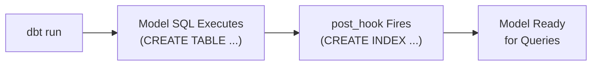
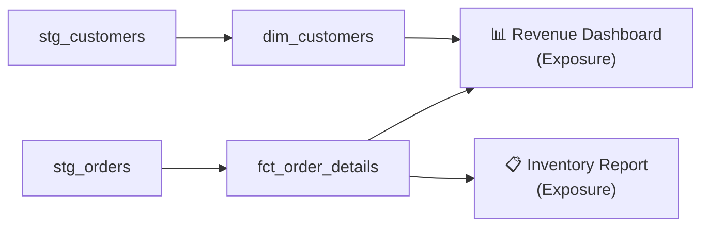

# Week 5: Hooks, Exposures, and Documentation

Welcome to Week 5 of the DataOps & dbt Mentorship Program! This week we shift from writing SQL to making our project **production-ready**. You will learn how to automatically run post-processing commands after a model builds, declare which dashboards depend on your data, and write documentation that makes your work understandable to the whole team.

---

## ✅ Prerequisites

Before starting Week 5, make sure you have completed **all of Week 4**:

- [ ] `packages.yml` installed and `dbt deps` succeeds
- [ ] `macros/convert_currency.sql` working
- [ ] `macros/calculate_revenue.sql` working
- [ ] `macros/macros.yml` with both macros documented
- [ ] `models/dev/fct_monthly_revenue.sql` using Jinja loops
- [ ] `models/dev/fct_order_details.sql` updated with surrogate key and macros

> **If your Week 4 models are not working yet, fix them first.** Week 5 builds directly on top of them.

---

## 📖 Lesson Overview

### What are Hooks?

A **hook** is a SQL statement that dbt runs automatically at a specific point in the model lifecycle. You configure them once and they fire every time the model builds — no manual steps required.

dbt supports two hook types:

| Hook | When It Runs |
| --- | --- |
| `pre_hook` | **Before** the model's SQL executes |
| `post_hook` | **After** the model's table/view is created |

The most common use case is `post_hook` — for example, creating an index on a freshly built table to speed up downstream queries.



**Hooks can be defined at two levels:**

- **Model level** — inside the `config()` block of a single model file. Use this when the hook only makes sense for one specific model.
- **Project level** — inside `dbt_project.yml` under the models block. Use this when the same hook should apply to all models in a layer.

### What are Exposures?

An **exposure** is a YAML definition that tells dbt about a downstream consumer of your data — such as a dashboard, a report, an ML model, or an API.

Without exposures, dbt has no idea what uses your models. When you add an exposure, dbt can:
- Show it in the **lineage graph** (`dbt docs serve`)
- Warn you when an upstream model that a dashboard depends on is broken



### What is dbt Documentation?

dbt lets you write plain-English descriptions for every model and every column directly in YAML files. These descriptions appear in the **dbt docs site** — a searchable, auto-generated data catalog that anyone on the team can browse.

Good documentation answers three questions:
1. **What** does this table contain?
2. **How** is each column calculated?
3. **Why** does this model exist (what business question does it answer)?

---

## 📝 Assignment Tasks

### Task 5.1 — Post-Hook: Create Indexes (25 pts)

Add `post_hook` entries to two DEV models so that PostgreSQL indexes are created automatically every time the model is rebuilt.

**What you need to do:**

| Model | Indexes to Create |
| --- | --- |
| `fct_order_details` | Index on `order_date`, Index on `customer_id` |
| `dim_customers` | Index on `country` |

**Rules:**
- Always use `CREATE INDEX IF NOT EXISTS` so the hook is **idempotent** (safe to run more than once)
- Name your indexes with a consistent pattern: `idx_<model_name>_<column>`
- The hook must go inside the model's `config()` block

**💡 Code Hints:**

For `fct_order_details.sql`, update the top `config()` block:

```sql
{{
    config(
        materialized='incremental',
        unique_key='order_item_id',
        post_hook=[
            "CREATE INDEX IF NOT EXISTS idx_fct_order_details_order_date   ON {{ this }} (order_date)",
            "CREATE INDEX IF NOT EXISTS idx_fct_order_details_customer_id  ON {{ this }} (customer_id)"
        ]
    )
}}
```

For `dim_customers.sql`, update its `config()` block:

```sql
{{
    config(
        materialized='table',
        post_hook="CREATE INDEX IF NOT EXISTS idx_dim_customers_country ON {{ this }} (country)"
    )
}}
```

> **Key concept:** `{{ this }}` is a dbt variable that resolves to the fully-qualified table name (e.g., `"ecommerce"."DEV"."fct_order_details"`). You must use it in hooks instead of hardcoding the table name.

> **Note:** When a model only has one hook, you can pass a string instead of a list. When it has multiple hooks, use a list `[...]`.

**Testing your work:**

```bash
# Rebuild fct_order_details with hooks
dbt run --select fct_order_details --full-refresh --profiles-dir .

# Rebuild dim_customers with hooks
dbt run --select dim_customers --profiles-dir .
```

Then verify the indexes were created in your SQL client:

```sql
-- Check that indexes were created
SELECT indexname, tablename, indexdef
FROM pg_indexes
WHERE schemaname = 'DEV'
ORDER BY tablename, indexname;
```

You should see `idx_fct_order_details_order_date`, `idx_fct_order_details_customer_id`, and `idx_dim_customers_country` in the results.

**Deliverable:** Updated `fct_order_details.sql` and `dim_customers.sql` with `post_hook` in the `config()` block.

| Criteria | Points |
| --- | --- |
| Correct `post_hook` syntax in model config | 5 |
| Index uses `IF NOT EXISTS` to be idempotent | 10 |
| Models build without errors | 5 |
| Student can query `pg_indexes` to verify the index was created | 5 |

---

### Task 5.2 — Post-Hook: Grant Permissions (10 pts)

Add a **project-level** post-hook in `dbt_project.yml` that runs a `GRANT` statement after every DEV model is built.

**What you need to do:**

Add a `+post_hook` to the `dev` layer in `dbt_project.yml` so that every table in the DEV schema is automatically granted `SELECT` access to all users.

**💡 Code Hints:**

Open `dbt_project.yml` and update the `dev` block:

```yaml
models:
  dbt_learning:
    stage:
      +schema: STAGE
      +materialized: view

    dev:
      +schema: DEV
      +materialized: table
      +post_hook: "GRANT SELECT ON {{ this }} TO PUBLIC"
```

> **Why `TO PUBLIC`?** In PostgreSQL, `PUBLIC` is a built-in pseudo-role that represents all users. Granting to `PUBLIC` makes the table readable by any database user — useful for giving BI tools read access without managing individual user permissions.

> **Key concept:** A project-level hook applies to **all** models in that directory (all of `models/dev/**`). It runs in addition to any model-level hooks — so `fct_order_details` will run both its index hooks AND the GRANT hook.

**Testing your work:**

```bash
# Run all dev models to trigger the project-level hook
dbt run --profiles-dir .
```

Then verify in your SQL client:

```sql
-- Check that GRANT was applied (look for PUBLIC in grantee column)
SELECT grantee, table_schema, table_name, privilege_type
FROM information_schema.role_table_grants
WHERE table_schema = 'DEV'
ORDER BY table_name;
```

**Deliverable:** Updated `dbt_project.yml` with `+post_hook` under the `dev` layer.

| Criteria | Points |
| --- | --- |
| Hook is defined at the project level (not model level) | 5 |
| `{{ this }}` correctly references the model being built | 5 |

---

### Task 5.3 — Exposures (25 pts)

Create `models/dev/_exposures.yml` that declares two downstream consumers of your dbt models.

**What you need to do:**

Define two exposures:

1. **Revenue Dashboard** — depends on `fct_order_details` and `dim_customers`
2. **Inventory Report** — depends on `stg_products` and `fct_order_details`

Each exposure must include:
- `name` — machine-readable identifier (snake_case)
- `type` — one of: `dashboard`, `notebook`, `analysis`, `ml`, `application`
- `maturity` — one of: `low`, `medium`, `high`
- `owner` — with `name` and `email` fields
- `depends_on` — list of model refs
- `description` — meaningful description (not just the name restated)

**💡 Code Hints:**

Create `models/dev/_exposures.yml`:

```yaml
version: 2

exposures:

  - name: revenue_dashboard
    type: dashboard
    maturity: high
    owner:
      name: "Your Name"
      email: "your@email.com"
    description: >
      The main revenue dashboard used by the sales and finance teams.
      Shows daily, monthly, and cumulative revenue broken down by store,
      product category, and customer country. Refreshed nightly.
    depends_on:
      - ref('fct_order_details')
      - ref('dim_customers')

  - name: inventory_report
    type: analysis
    maturity: medium
    owner:
      name: "Your Name"
      email: "your@email.com"
    description: >
      A weekly inventory and product performance report used by the
      procurement team. Tracks stock turnover rates, identifies
      low-margin products, and flags items with abnormal discount rates.
    depends_on:
      - ref('stg_products')
      - ref('fct_order_details')
```

> **Tip:** Replace `"Your Name"` and `"your@email.com"` with your actual details — the grading script checks that the `owner` fields are filled in.

**Testing your work:**

```bash
# Compile to validate the YAML syntax
dbt compile --profiles-dir .

# Generate docs and open the docs site
dbt docs generate --profiles-dir .
dbt docs serve --profiles-dir .
```

In the docs site, click on **"Exposures"** in the left sidebar. You should see your two exposures listed. Click on one to view its lineage graph — it will show which models feed into the exposure.

**Deliverable:** `models/dev/_exposures.yml`

| Criteria | Points |
| --- | --- |
| Both exposures defined with correct syntax | 10 |
| `depends_on` correctly lists model refs | 5 |
| Owner information is filled in | 5 |
| Descriptions are meaningful (not placeholder text) | 5 |

---

### Task 5.4 — Model Documentation (25 pts)

Write descriptions for all your models and their key columns in YAML schema files.

**What you need to do:**

1. Update `models/stage/_schema.yml` to add a `description` to every staging model
2. Create `models/dev/_schema.yml` with descriptions for every DEV model **and** full column-level documentation for `fct_order_details` and `dim_customers`

**💡 Code Hints:**

**`models/stage/_schema.yml`** — add model-level descriptions:

```yaml
version: 2

models:
  - name: stg_customers
    description: >
      Cleaned and standardised customer records from the raw seed data.
      Trims whitespace from names, lowercases email addresses, and casts
      signup_date to a proper date type. One row per customer.

  - name: stg_products
    description: >
      Cleansed product catalog from raw seed data. Trims product names,
      casts prices to numeric(12,2), and converts is_active from text to
      boolean. One row per product.

  - name: stg_orders
    description: >
      Cleaned order headers. Lowercases and trims order_status, casts
      order_date to date, and defaults null shipping_fee values to 0.
      One row per order.

  - name: stg_order_items
    description: >
      Cleaned line items for each order. Casts quantity to integer and
      prices to numeric(12,2). Defaults null discount_pct to 0.
      One row per order line item.

  - name: stg_store_locations
    description: >
      Cleaned store location dimension. Trims all text fields and casts
      opened_date to date. One row per store.
```

**`models/dev/_schema.yml`** — model-level + column-level documentation:

```yaml
version: 2

models:
  - name: fct_order_details
    description: >
      The central fact table of the project. Contains one row per order
      line item enriched with customer, product, and store information.
      Calculated columns include net revenue (after discount) and USD-
      converted amounts using fixed exchange rates.
    columns:
      - name: order_detail_sk
        description: Surrogate key — MD5 hash of order_id and order_item_id. Stable unique identifier for each row.
      - name: order_item_id
        description: Natural key from the source system. Unique identifier for each line item.
      - name: order_id
        description: Foreign key linking to the parent order in stg_orders.
      - name: order_date
        description: The date the order was placed. Used for partitioning in the incremental load.
      - name: customer_id
        description: Foreign key to the customer who placed the order.
      - name: customer_name
        description: Full name of the customer, derived as first_name || ' ' || last_name from stg_customers.
      - name: store_id
        description: Foreign key to the store where the order was placed.
      - name: product_id
        description: Foreign key to the product purchased on this line item.
      - name: product_name
        description: Display name of the product as it appears in the product catalog.
      - name: category
        description: Product category (e.g. Electronics, Clothing). Used for revenue breakdowns.
      - name: currency
        description: The currency code the product was priced in (USD, OMR, or EUR).
      - name: quantity
        description: Number of units ordered on this line item.
      - name: unit_price
        description: Price per unit at the time of purchase, in the product's original currency.
      - name: discount_pct
        description: Percentage discount applied to this line item (0–100). Defaults to 0 if not specified.
      - name: net_amount
        description: >
          Revenue after discount in the original currency.
          Calculated as: quantity × unit_price × (1 − discount_pct / 100).
      - name: shipping_fee
        description: Flat shipping fee for the parent order, allocated to this line item.
      - name: total_amount
        description: Net amount plus the shipping fee, in the original currency.
      - name: total_amount_usd
        description: >
          Total amount converted to USD using fixed exchange rates
          (1 OMR = 2.60 USD, 1 EUR = 1.08 USD). Used for cross-currency comparisons.

  - name: dim_customers
    description: >
      Customer dimension table aggregating order history per customer.
      Joins stg_customers with order totals to provide a single view of
      each customer's profile and spending behaviour.
    columns:
      - name: customer_id
        description: Primary key. Unique identifier for each customer.
      - name: full_name
        description: Customer's full name, derived as first_name || ' ' || last_name.
      - name: email
        description: Customer's email address (lowercased and trimmed in the stage layer).
      - name: country
        description: Country where the customer is registered. Used for geographic segmentation.
      - name: city
        description: City where the customer is registered.
      - name: signup_date
        description: The date the customer created their account.
      - name: total_orders
        description: Total number of orders placed by this customer across all time.
      - name: total_spent
        description: Sum of total_amount across all orders for this customer, in the order's original currency.

  - name: fct_monthly_revenue
    description: >
      Pivot table showing revenue by store and month for a single target year.
      Each row is one store; columns jan_revenue through dec_revenue hold the
      total net revenue for that month. Generated dynamically using a Jinja loop.

  - name: quarantine_orders
    description: >
      Holds orders that failed one or more data quality checks. Captures rows with
      future order dates, missing customer IDs, negative shipping fees, or invalid
      status values. Used for investigation and upstream data fix tracking.
```

> **What makes a good description?**
> - Explains **what the column means**, not just what it's named
> - Notes **how it is calculated** when the value is derived
> - Mentions **units or ranges** when relevant (e.g., "0–100", "USD")
> - Is written so a new team member can understand it without reading the SQL

**Testing your work:**

```bash
# Validate your YAML and generate the docs site
dbt docs generate --profiles-dir .
dbt docs serve --profiles-dir .
```

Navigate to `fct_order_details` in the docs site. You should see:
- A model description at the top
- A full column list with descriptions

**Deliverable:** `models/stage/_schema.yml` (updated) + `models/dev/_schema.yml` (new)

| Criteria | Points |
| --- | --- |
| All models have descriptions | 5 |
| All columns in `fct_order_details` documented | 10 |
| All columns in `dim_customers` documented | 5 |
| Descriptions are clear and helpful (not just the column name restated) | 5 |

---

### Task 5.5 — Generate and Review Docs Site (15 pts)

Generate the dbt documentation site and take screenshots proving everything is connected.

**What you need to do:**

1. Run `dbt docs generate` to build the catalog
2. Run `dbt docs serve` to open the docs site in your browser
3. Take three screenshots:
   - The **DAG (lineage graph)** showing your full project from seeds → stage → dev → exposures
   - The **documentation page** for `fct_order_details` showing model description and column list
   - The **exposure page** for either `revenue_dashboard` or `inventory_report` showing its upstream dependencies

**💡 How to navigate the docs site:**

| What to find | Where to look |
| --- | --- |
| Lineage graph | Click any model → bottom panel shows the DAG |
| Full project DAG | Click "**Lineage**" in the top navigation |
| Exposures | Left sidebar → "**Exposures**" |
| Model docs | Left sidebar → expand **dbt_learning** → **Models** → **dev** or **stage** |

**Testing your work:**

```bash
# Step 1 — Build the catalog (reads compiled SQL + run results)
dbt docs generate --profiles-dir .

# Step 2 — Open the docs site (available at http://localhost:8080)
dbt docs serve --profiles-dir .
```

> **Tip:** If port 8080 is in use, specify a different port: `dbt docs serve --port 8081 --profiles-dir .`

**Deliverable:** Three screenshots saved in your submission folder:
- `screenshot_dag.png`
- `screenshot_fct_order_details_docs.png`
- `screenshot_exposure.png`

| Criteria | Points |
| --- | --- |
| Docs generate without errors | 5 |
| DAG screenshot shows correct lineage | 5 |
| Exposure visible in docs | 5 |

---

### Week 5 Total: **100 points**

---

## 🔧 dbt Commands Reference

```bash
# Run all models
dbt run --profiles-dir .

# Run a specific model
dbt run --select fct_order_details --full-refresh --profiles-dir .

# Run all tests
dbt test --profiles-dir .

# Compile (inspect generated SQL without running)
dbt compile --select fct_order_details --profiles-dir .

# Generate the docs catalog
dbt docs generate --profiles-dir .

# Open the docs site in your browser
dbt docs serve --profiles-dir .

# Open the docs site on a different port
dbt docs serve --port 8081 --profiles-dir .
```

---

## 📂 Expected File Structure After Week 5

```
dbt_learning/
├── dbt_project.yml                       ← UPDATED (project-level post_hook)
├── packages.yml
├── dbt_packages/
│   └── dbt_utils/
├── macros/
│   ├── convert_currency.sql
│   ├── calculate_revenue.sql
│   ├── macros.yml
│   └── generate_schema_name.sql
├── models/
│   ├── stage/
│   │   ├── sources.yml
│   │   ├── _schema.yml                   ← UPDATED (model descriptions)
│   │   ├── stg_customers.sql
│   │   ├── stg_products.sql
│   │   ├── stg_orders.sql
│   │   ├── stg_order_items.sql
│   │   └── stg_store_locations.sql
│   └── dev/
│       ├── _schema.yml                   ← NEW (model + column docs)
│       ├── _exposures.yml                ← NEW
│       ├── fct_order_details.sql         ← UPDATED (post_hook for indexes)
│       ├── fct_monthly_revenue.sql
│       ├── dim_customers.sql             ← UPDATED (post_hook for index)
│       └── quarantine_orders.sql
├── snapshots/
│   └── snap_products.sql
├── tests/
│   ├── test_no_future_orders.sql
│   ├── test_positive_quantities.sql
│   ├── test_valid_discount_range.sql
│   ├── test_positive_shipping.sql
│   └── test_positive_cost_price.sql
└── docs/
    ├── materializations.md
    └── data_quality_report.md
```

---

## 🤖 Auto-Grade Your Work

Once you have completed all tasks, run the grading script to check your progress:

```bash
python scripts/grade_assignment.py --week 5
```

The script will verify that your files exist, contain the correct patterns, and follow the assignment requirements. Fix any ❌ items and re-run until you are satisfied with your score.

Good luck! 🚀
